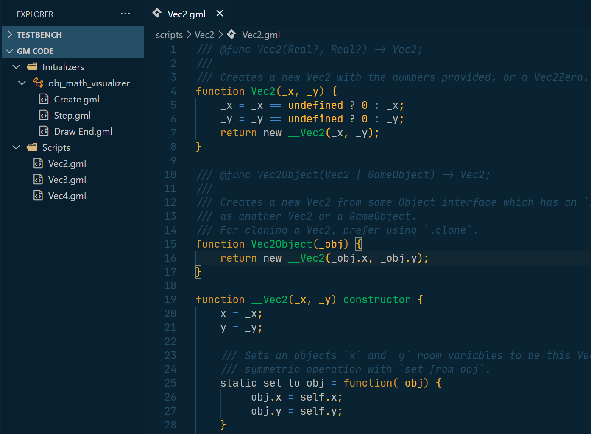

# gm-code-vsc

This is a *highly* alpha Gms2 extension for Visual Studio Code. It provides support to show the Asset Browser in Visual Studio Code.

**Note: only the most recent version of Gms2 is supported.**

## Status

This extension is under active development. The current goals for 0.2.0 are:

- TextMate grammer for excellent Gms2 colorization
- `adam`, to compile and run GameMaker projects from VSC.
- Autocomplete for built in Gms2 functions
- Shader Support
- Some generalized resource support
- Folder Renaming

For more details, make sure to checkout the [ROADMAP](./ROADMAP.md).

## Features

- View your Gms2 Asset Tree in Visual Studio Code
  

  *Note: this extension only supports Objects, Scripts, and Sprites -- all other resources will be undetected by the extension for now. We plan to support at least showing all resources!*

- Simply click on any code file (script, object event) to open the text file to edit.
- Add and Delete Scripts, Objects, and Events by simply right clicking in the Asset Browser, just like in Gms2
  

  *Note: not all events can be created yet, but all events will be display and can be deleted.*
- And that's it!

We do not currently have any language tools at all, including colorization or autocomplete support. We also do not provide any ability to run projects in Visual Studio Code. All the above features are planned for 0.2.0 -- see our [Roadmap](./ROADMAP.md) to see what we have planned. For now, you can use [this extension](https://github.com/gml-support/gml-support) for decent colorisation.
