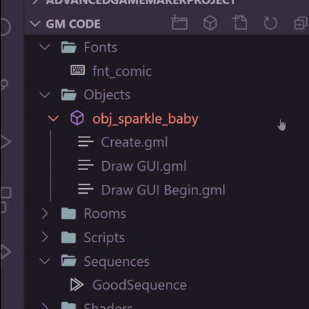
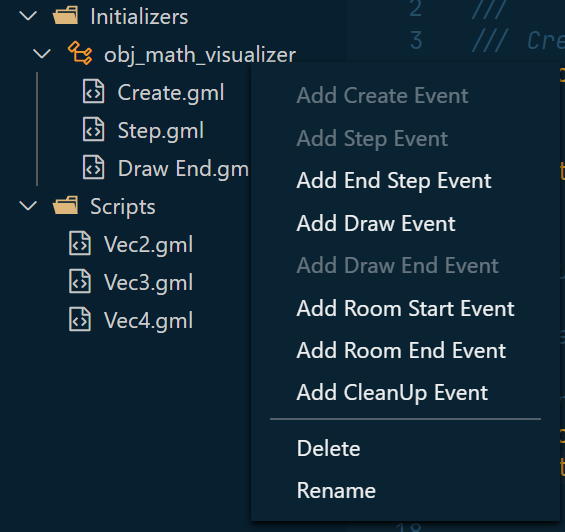

# gm-code-vsc

This is a *highly* alpha Gms2 extension for Visual Studio Code. It provides support to show the Asset Browser in Visual Studio Code.

To download this extension, please [go to the Visual Studio Code marketplace here](https://marketplace.visualstudio.com/items?itemName=sanbox.gm-code-vsc).

**Note: only the most recent STABLE version of Gms2 is supported.**

If you're a *user*, please read the [getting started guide here](./docs/getting_started.md) for an introduction to the various features gm-code-vsc provides.

## Status

This extension is under active development. The current goals for 0.3.0 are:

- TextMate grammer for excellent Gms2 colorization
- Intellisense for built in Gms2 functions
- Intellisense for resources within a project
- Function lookups

Our [CHANGELOG is here](./CHANGELOG.md), and for more on the future goals of this project, look [here at our ROADMAP](./ROADMAP.md).

## Features

- View your Gms2 Asset Tree in Visual Studio Code

  

- Simply click on any code file (script, object event, shader) to open the text file to edit.
- Add and Delete Scripts, Objects, and Events by simply right clicking in the Asset Browser, just like in Gms2
  

- Compile Gms2 using *adam*, a command-line Gms2 compiler invoker, which you can get separately [here](https://github.com/NPC-Studio/adam).
